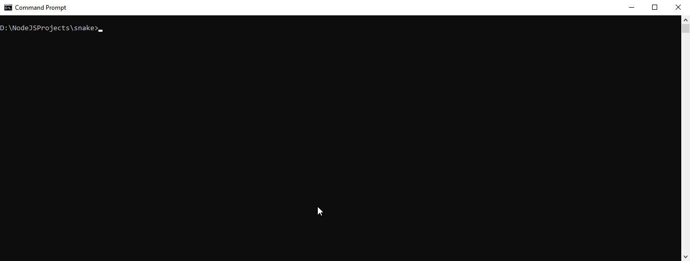

<h1 align="center">Oldschool game 'Snake'</h1>


## Description

<p align="center">

Simple oldschool game 'Snake' for console, may be played just in Node.js terminal or on Windows Command Prompt (cmd.exe)

</p>


## Project setup and run

- Download project files, then in project folder run command:
```
npm install
```
- Make sure terminal **window size enough** to play, then run command:
```
npm run start
```
Note: it's not recommended to resize terminal window during the play due possibility of unexpectable cursor moving and graphical output crashing


## How to play
- Use **keyboard arrows** to move snake
- **Pick up** yellow 'cookies' to get score
- **Avoid** of red obstacles and boundaries
- You may toogle **pause** with 'p' key
- Press 'Ctrl+C' to **exit**


## Project structure

Program consist of 3 main classes:
- **Game** - describes game environment such as game loop, user's control maintance and graphical output. See <a href='Game.js'>*Game.js*</a>
- **Snake** - describes structure of snake's body with it's fractures and directions of movement for each fracture (without any graphical output). This class used by *Game* class. See <a href='Snake.js'>*Snake.js*</a>
- **Interface** - describes input and output interface used by *Game* class, see <a href='Interface.js'>*Interface.js*</a>

## Dependencies and other requirements

This project uses **the only one external module** 'chalk' for styling text in console (see <a href='https://github.com/chalk/chalk'>https://github.com/chalk/chalk</a>)

This project requires of **Node.js 12+** due private classes fields used
